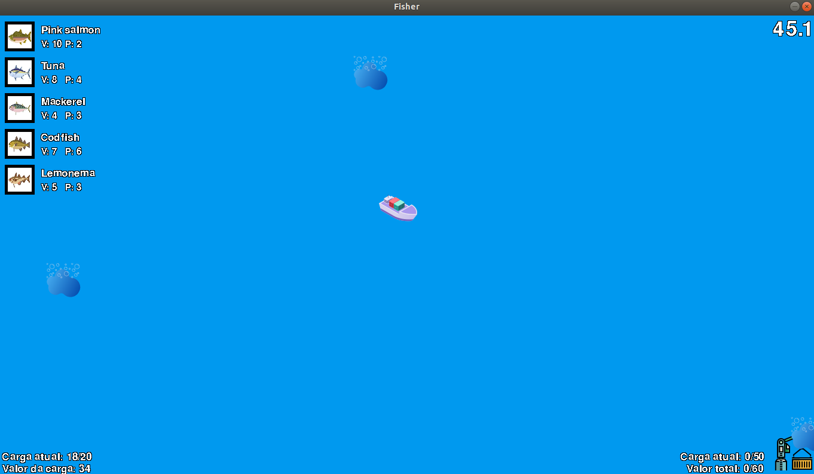
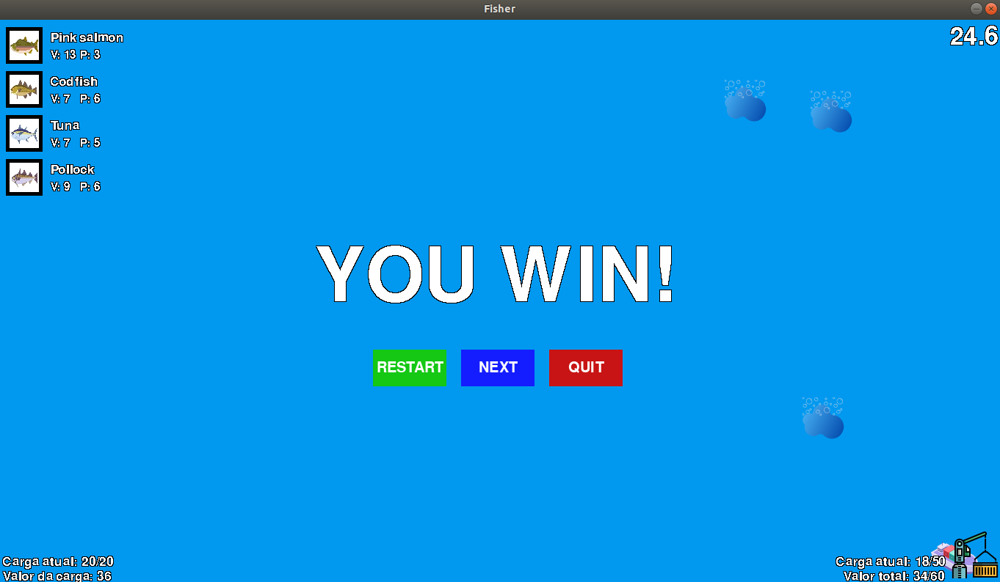
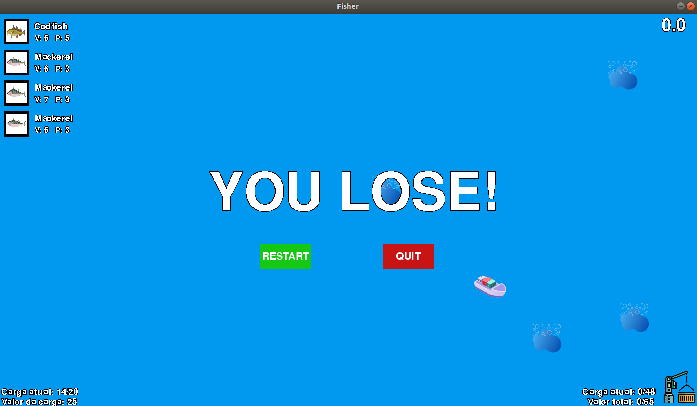
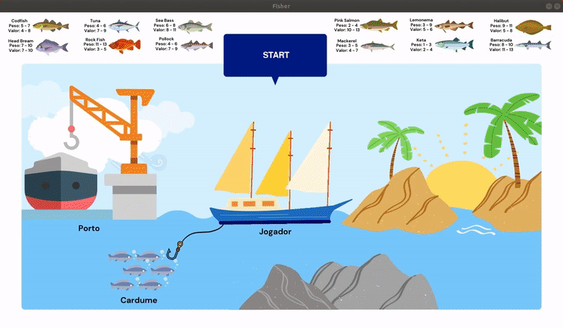

# Fisher

**Número da Lista**: 5<br>
**Conteúdo da Disciplina**: Programação Dinâmica<br>

## Alunos
|Matrícula | Aluno |
| -- | -- |
| 17/0129411  |  Guilherme Mendes Pereira |
| 17/0163571  |  Murilo Loiola Dantas |

## Sobre 

Fishing é um jogo onde o jogador controla uma embarcação pesqueira que deve entregar um valor mínimo em pescados para o porto da cidade. O projeto utiliza o algoritmo de Knapsack para determinar a melhor combinação de pescados que será mantida no porto, dado que o jogador precisará fazer várias viagens para cumprir a cota exigida.

## Screenshots
* ### Menu


* ### Tela inicial do Jogo



* ### Tela de vitória da fase



* ### Tela de derrota



* ### Jogo



## Instalação 
**Linguagem**: Python<br>
**Pré-requisitos**: [Python](https://www.python.org/downloads/), [pygame](https://www.pygame.org/wiki/GettingStarted) e [pip](https://packaging.python.org/tutorials/installing-packages/).<br>
**Execução do projeto** <br>

* Clone o repositório:
```bash
git clone https://github.com/projeto-de-algoritmos/D-C_Fisher.git
```
* Acesse o repositório e instale as bibliotecas necessárias:
```bash
cd D-C_Fisher/
pip3 install -r requirements.txt
```
* Execute o Fisher e divirta-se:
```bash
python3 src/game.py
```

## Uso 

### Vídeo explicativo
[Video]()

* Player - navio branco.
* Local de entrega - porto.
* Cardumes - manchas na água.

* Clique com o botão esquerdo do mouse em *Start*
* Controle o player com ←, ↑, →,  ↓ do teclado.
* Pegue os cardumes passando por eles.
* Aperte a tecla ESPAÇO para descartar o último cardume pescado.
* Clique em *Restart* para jogar novamente.
* Clique em *Next* para avançar de fase.
* Clique em *Quit* para encerrar o jogo.

## Outros 
* Cada fase tem um limite de 80 segundos de duração. Caso o tempo acabe antes do jogador cumprir a cota exigida, o jogador perderá.
* Não será possível pescar cardumes que excedam o limite máximo de carga do navio (20 unidades). É importante observar os cardumes pescados para descartá-los quando o jogador considerar que não valem a pena.
* Ao colidir com o porto, o programa executará o Knapsack utilizando todos os cardumes que estão no porto + todos os cardumes que o jogador possui. O programa escolherá a melhor combinação de cardumes para manter no porto, maximizando o valor. Os cardumes restantes serão descartados (tanto do jogador, quanto do porto).
* Alguns cardumes são mais raros que outros.


